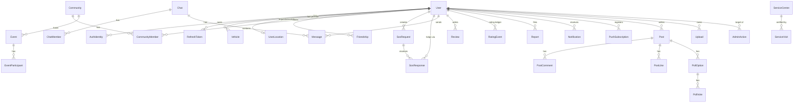

# AutoCommunity — Architecture

Companion to `SPEC.md` (what) and `API.md` (contract). This file is the *how*.

## 1. Stack

| Layer | Choice | Why |
|---|---|---|
| Monorepo | **pnpm workspaces** | One install, shared types between API and web, no extra build tool. |
| Language | **TypeScript (strict)** everywhere | One language, compile-time contract between client and server. |
| Shared contract | **zod** schemas in `packages/shared` | Same schema validates requests on the server and forms on the client; types are inferred, never hand-copied. |
| Backend | **NestJS 11** (Express adapter) | Plan's choice; modules + DI + guards map cleanly onto auth/roles/privacy rules. |
| Database | **PostgreSQL 16 + PostGIS 3** | Plan's choice; `ST_DWithin` / `ST_MakeEnvelope` with GiST indexes for radius and bbox queries. |
| ORM | **Prisma 6** | Typed client, migrations. Geography columns are `Unsupported("geography(Point,4326)")`; geo queries use `$queryRaw` tagged templates (always parameterized). |
| Cache / queues / rate limits | **Redis 7** + **BullMQ** | Socket.IO fan-out across instances, rate-limit counters, delayed jobs (SOS radius expansion, expiry, push delivery). |
| Realtime | **Socket.IO** (+ `@socket.io/redis-adapter`) | Plan's choice; rooms map to chats, SOS and user channels; automatic reconnection. |
| Auth | Own **JWT**: access 15 min (Bearer, in memory) + refresh 30 days (httpOnly, `SameSite=Strict`, rotated, hashed in DB) | No third-party auth service needed; refresh-reuse detection revokes the whole token family. |
| Login methods | Phone + OTP (SMS adapter: console in dev / Twilio), Google (`google-auth-library` ID-token check), Apple (`jose` + Apple JWKS) | Plan's choice. OAuth buttons show only when client IDs are set. |
| File storage | **S3-compatible** via AWS SDK v3 (MinIO / Cloudflare R2) + `local` disk driver for dev | R2 in prod per plan, same code path. |
| Image processing | **sharp** | Resize to 3 sizes, convert to WebP, **strip EXIF (removes GPS)**. Magic-byte check with `file-type`. |
| Push | **Web Push (VAPID)** via `web-push`; FCM adapter interface for a future native client | Works in installed PWAs on Android, iOS 16.4+, desktop. |
| Frontend | **Next.js 15** (App Router) | Mainstream React framework, PWA-capable, SSR for public pages. |
| Data fetching | **TanStack Query** | Caching, infinite scroll, optimistic updates. |
| UI | **Tailwind CSS 4** + **Radix UI** primitives (shadcn/ui pattern) | Accessible primitives (focus, ARIA, keyboard) with our own design tokens. |
| Maps | **MapLibre GL JS** + OpenStreetMap tiles (Mapbox style URL optional via env) | Open-source fork of Mapbox GL; built-in GeoJSON clustering. Swapping to Mapbox = env change. |
| i18n | **next-intl** (ru default, en) | Pilot city is Almaty. |
| Theme | CSS variables + `next-themes` | Dark mode (plan doesn't forbid it). |
| Tests | **Vitest** (unit), **Vitest + Supertest** against a real Postgres (integration), **Playwright** (e2e), **k6** (load) | Integration tests run real PostGIS queries — mocks would hide the most important bugs. |
| Logging | **pino** (`nestjs-pino`) JSON logs, request IDs | Structured, cheap. |
| Hosting (target) | API + worker: Docker on Fly.io/Render. Web: Vercel. DB: managed Postgres with PostGIS (Neon/Supabase). Redis: Upstash. Files: R2. | All have free/cheap tiers for a pilot. `docker-compose.yml` runs the whole thing locally. |

**Deviation from PLAN.md:** client is a PWA, not Flutter (owner decision Q-1). The REST + Socket.IO API is client-agnostic.

## 2. Folder structure

```
autocommunity/
├─ apps/
│  ├─ api/                     NestJS
│  │  ├─ prisma/               schema.prisma, migrations/, seed/
│  │  ├─ src/
│  │  │  ├─ main.ts            bootstrap (helmet, cors, cookie, pino)
│  │  │  ├─ worker.ts          BullMQ worker entry (same codebase)
│  │  │  ├─ common/            guards, pipes (zod), filters, decorators, pagination, geo helpers
│  │  │  ├─ infra/             prisma, redis, storage, sms, push, queue adapters
│  │  │  └─ modules/
│  │  │     auth/ users/ vehicles/ location/ map/ friends/
│  │  │     communities/ chats/ sos/ ratings/ reviews/ reports/
│  │  │     notifications/ uploads/ services/ events/ feed/ admin/ realtime/
│  │  └─ test/                 integration tests (supertest), factories
│  └─ web/                     Next.js
│     ├─ src/app/
│     │  ├─ (public)/          landing, login, legal
│     │  ├─ (app)/             map, sos, communities, chats, feed, services, events, profile, notifications, settings
│     │  └─ admin/             admin panel (role-guarded)
│     ├─ src/components/ui/    design-system primitives
│     ├─ src/components/       feature components
│     ├─ src/lib/              api client, socket, auth store, hooks
│     ├─ messages/             ru.json, en.json
│     ├─ public/               manifest, icons, service worker
│     └─ e2e/                  Playwright specs
├─ packages/
│  └─ shared/                  zod schemas, enums, constants (rating weights, limits), shared types
├─ load/                       k6 scripts
├─ docker-compose.yml          postgres+postgis, redis, minio, api, worker, web
├─ SPEC.md ARCHITECTURE.md API.md DESIGN.md PROGRESS.md KNOWN_GAPS.md README.md
```

## 3. Data model (ERD)



Key tables and indexes (full columns in `apps/api/prisma/schema.prisma`):

| Table | Notable columns | Indexes |
|---|---|---|
| `users` | phone (unique, E.164), nickname (unique, citext), rating (int 0–100), privacy_mode enum, role enum, status enum, sos_banned_until, receive_sos bool | unique(phone), unique(lower(nickname)), (city) |
| `user_locations` | user_id PK, location geography(Point), updated_at | **GiST(location)**, (updated_at) |
| `friendships` | requester_id, addressee_id, status | unique(least,greatest pair), (addressee_id, status) |
| `community_members` | community_id, user_id, role, status | PK(community_id,user_id), (user_id,status) |
| `sos_requests` | type, status, location geography, radius_m, expires_at, closed_at | **GiST(location)**, (status, created_at), (user_id, created_at) |
| `sos_responses` | sos_id, helper_id, status | unique(sos_id, helper_id), (helper_id) |
| `service_centers` | category, status, location geography, rating, qr_secret | **GiST(location)**, (category, status) |
| `messages` | chat_id, sender_id, type, body jsonb, created_at | (chat_id, created_at desc, id) |
| `reviews` | target_type, target_id, author_id, ref_id, stars | unique(author_id, target_type, target_id, ref_id), (target_type, target_id) |
| `rating_events` | user_id, delta, reason, ref_id | (user_id, created_at) |
| `notifications` | user_id, type, payload jsonb, read_at | (user_id, created_at desc), partial (user_id) where read_at is null |
| `posts` | author_id, community_id?, text, media jsonb | (created_at desc, id), (community_id, created_at desc) |

All list endpoints use **keyset (cursor) pagination** on `(created_at, id)` — stable under inserts, no `OFFSET` scans.

## 4. API design

- REST under `/api/v1`, JSON, camelCase. Full contract in **API.md**.
- Errors: `{ error: { code: "SOS_RATE_LIMIT", message, details? } }` + proper HTTP status.
- Lists: `?cursor=&limit=` (max 50) → `{ items, nextCursor }`.
- Validation: every body/query/param goes through a zod schema from `packages/shared` (`ZodValidationPipe`); unknown keys stripped.
- Realtime: Socket.IO namespace `/rt`, authenticated with the access token on handshake. Rooms: `user:{id}`, `chat:{id}`, `sos:{id}`. Server only joins a socket to a room after an authorization check.
- Writes that fan out (SOS dispatch, push) go through BullMQ jobs so HTTP latency stays flat.

## 5. Auth & permissions model

**Authentication**
1. `POST /auth/otp/request` → rate-limited (per phone 1/60 s & 5/h, per IP 20/h, global circuit breaker) → 6-digit code, stored as HMAC hash, 5-min TTL.
2. `POST /auth/otp/verify` → max 5 attempts per code, then code burned; lockout after 10 failed codes/h per phone → returns access token + sets refresh cookie.
3. `POST /auth/refresh` → rotates refresh; reuse of a revoked token revokes the whole family (theft detection). Requires `X-CSRF` header matching a non-httpOnly csrf cookie (double-submit) because it's cookie-authenticated.
4. Blocked users: every request checks `status` (cached 60 s in Redis); blocking also revokes refresh tokens and disconnects sockets.

**Authorization layers**
- `JwtAuthGuard` global; public routes opt out with `@Public()`.
- `RolesGuard` for `admin`.
- Resource policies in services (not controllers): e.g. `CommunityPolicy.canModerate(user, communityId)`, `ChatPolicy.canRead(user, chatId)`, `SosPolicy.canRespond(user, sos)`.
- **Location visibility** (`MapPolicy`, enforced in SQL so hidden rows never leave the DB):
  - `hidden` → never returned.
  - `friends` → returned only to accepted friends.
  - `community` → returned to users sharing ≥1 active community (and friends).
  - `everyone` → returned to all authenticated users.
  - Exact coordinates only for friends and co-members of a shared *private* community; everyone else allowed to see the user (including co-members of public communities) gets them snapped to a ~500 m grid, with the timestamp rounded to the minute.
  - Positions older than 15 min are not returned. Plate number is never part of map payloads.

**Security checklist (applies to every phase)**
helmet headers + strict CSP on web, CORS allow-list, zod validation, Prisma/parameterized SQL only, output escaping by React (no `dangerouslySetInnerHTML` on user content), rate limits (Redis) on auth/SOS/uploads/messages/reports, upload checks (magic bytes, MIME allow-list, size caps, image re-encode + EXIF strip, random keys), secrets only via env (validated at boot with zod), audit log for admin actions.

## 6. Key algorithms

**SOS dispatch** (`sos.dispatch` job): find users with `receive_sos = true`, status active, rating ≥ helper threshold, location fresh < 15 min, `ST_DWithin(location, sos.location, radius)`, excluding requester and users who blocked/reported them → order by distance → top 20 → notification (in-app + push) + socket event. Delayed jobs expand radius 5 → 10 → 20 km at +5 / +10 min if no response; `sos.expire` at +2 h.

**Trust rating** (A-8 in SPEC): pure function in `packages/shared/rating.ts`, computed from the `rating_events` ledger + aggregates, recomputed on each new event. Unit-tested with fixed inputs.

**Antifraud v1**: per-user SOS limits (3/24 h), cooldown after cancel, auto SOS-ban after 2 cancelled/fake in 7 days, duplicate-photo hash check across a user's SOS, new-account limits (accounts < 24 h can't create SOS unless rating ≥ 50 and phone verified — they are, so effectively a limit of 1).

## 7. Phase plan

Each phase ends with: features working UI → API → DB → UI, tests (unit + integration + ≥1 Playwright flow) green, PROGRESS.md updated, review pass done.

| # | Phase | Contents | Testable end state |
|---|---|---|---|
| 1 | Foundation + auth + profile | Monorepo, docker-compose, Prisma schema v1, env validation, logging, design system + app shell (nav, theme, i18n), OTP auth + refresh, Google/Apple (env-gated), onboarding, profile, vehicles, uploads (avatar), legal pages, seed v1 | Register by phone → onboarding → edit profile/car → log out/in |
| 2 | Map, privacy, friends, notifications | Location updates, map with clustering, privacy modes (server-side), go-invisible, friends, notifications (in-app + web push), realtime socket base | Two users see each other per privacy rules; friend request → notification |
| 3 | Communities + community chat | CRUD, open/closed, join requests, moderators, content removal, map filters (community/several/friends/brand), chat engine + community chat | Create closed community → request → approve → chat in realtime → filter map |
| 4 | SOS + direct chats | SOS create/dispatch/lifecycle/expiry, SOS card, Help/Call/Message, 112 button, share link, SOS group chat, direct chats (text/photo/location/voice) | Full SOS from creation to close between two browsers |
| 5 | Ratings, reviews, reports | Mutual SOS reviews, rating ledger + formula, penalties, reports on users/content | MVP acceptance flow end to end, rating changes visible |
| 6 | Admin + antifraud + hardening | Admin panel (users/communities/SOS/reports/audit), antifraud v1, k6 load test, security review | Admin blocks a user → user is logged out and can't SOS |
| 7 | Services catalog (v2) | Categories, map + list, cards, submit service, admin verification, visit verification (geo/QR/photo), service reviews + rating | Find service → verify visit → review → rating updates |
| 8 | Events, feed, polish (v2) | Events + RSVP + route + event chat, feed with photo/video/polls/likes/comments, push for all event types, accessibility pass, README, KNOWN_GAPS | Full regression suite green; one-command setup documented |
| 9 | Monetization and trust | Coin wallet (demo payment provider, transfers, ledger), premium for coins with a renewal job, driver votes (new rating component), vehicle violations with moderation and penalties, vehicle details, rating tiers | Top up with the test card → transfer → subscribe to premium → vote → report a violation → admin approves → rating changes |

## 8. Agent workflow

- **API.md is written and frozen per phase before code.** Changes go through API.md first, then `packages/shared` schemas, then both sides.
- Backend and frontend agents work in parallel only on a phase whose API section is frozen.
- Design agent produces `DESIGN.md` + `components/ui` in Phase 1; later phases reuse it.
- QA agent writes tests against API.md (not against the implementation) and runs the Playwright flows.
- Review agent gates each phase: security, N+1, indexes, consistency with API.md.
