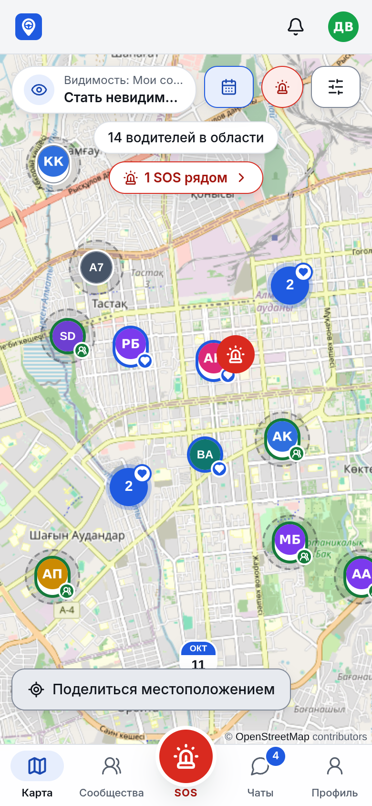
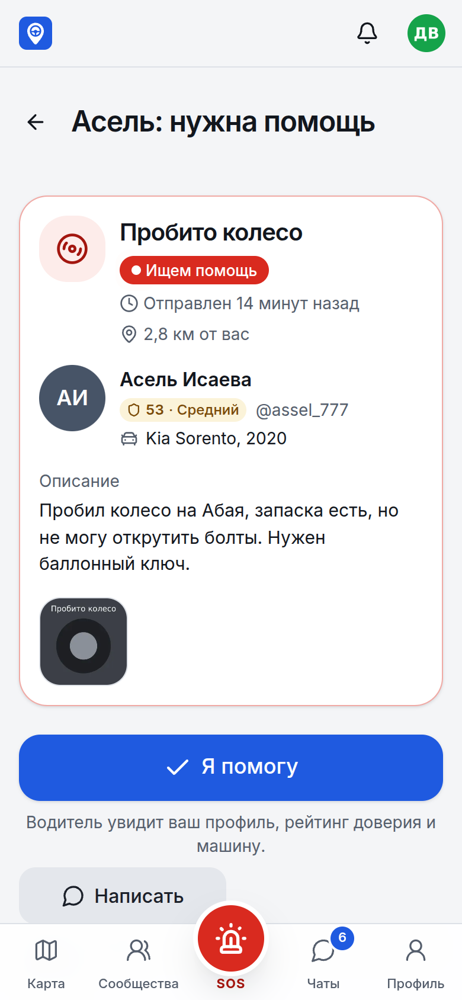
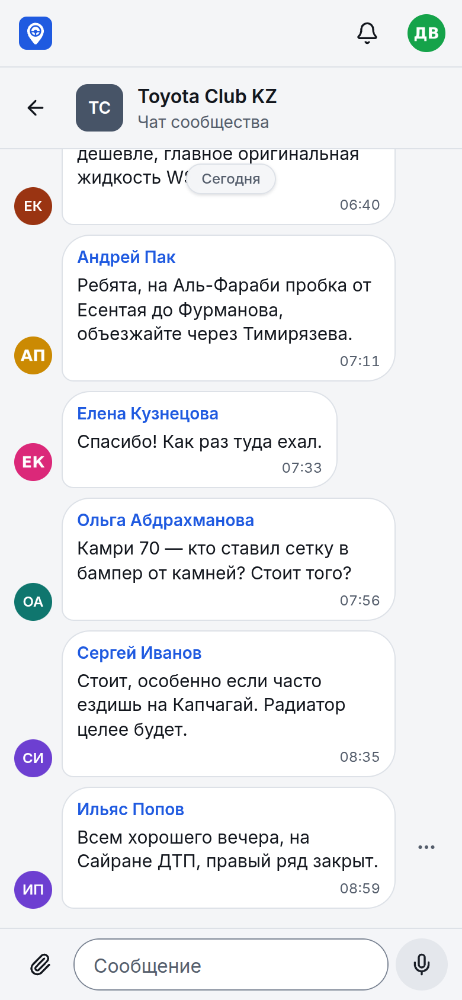
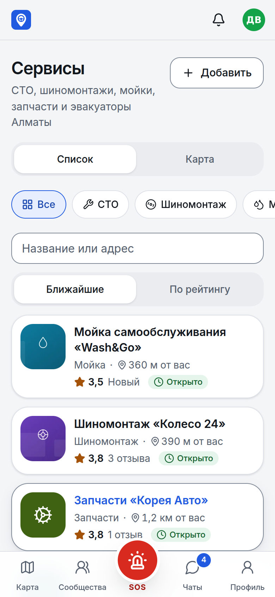
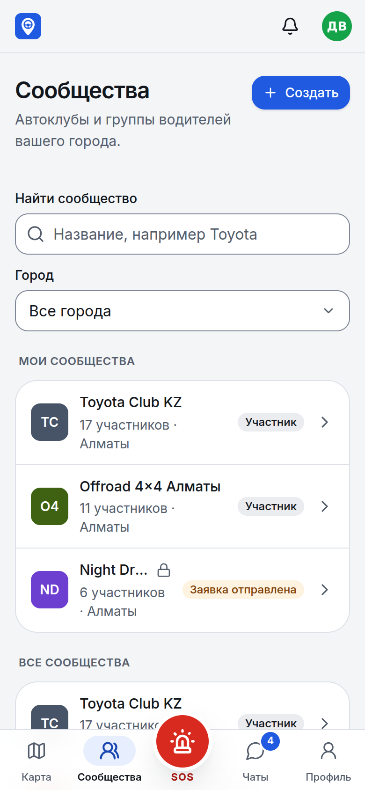
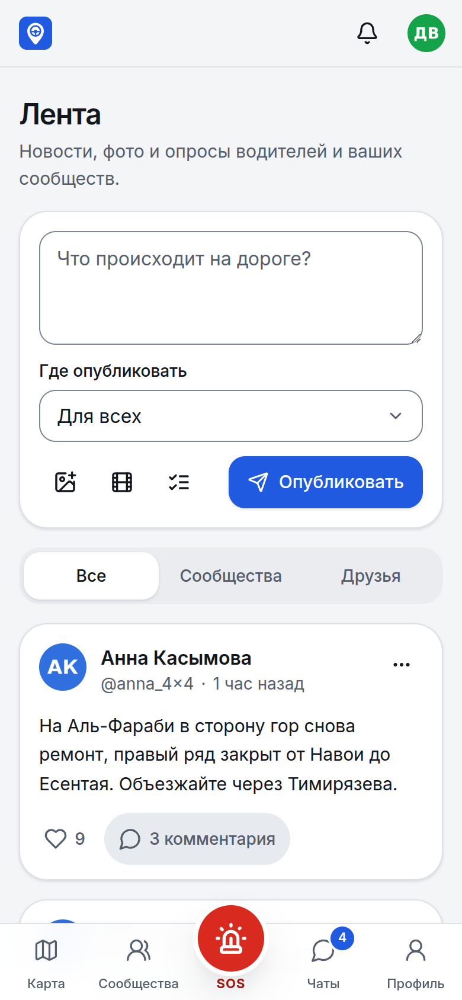
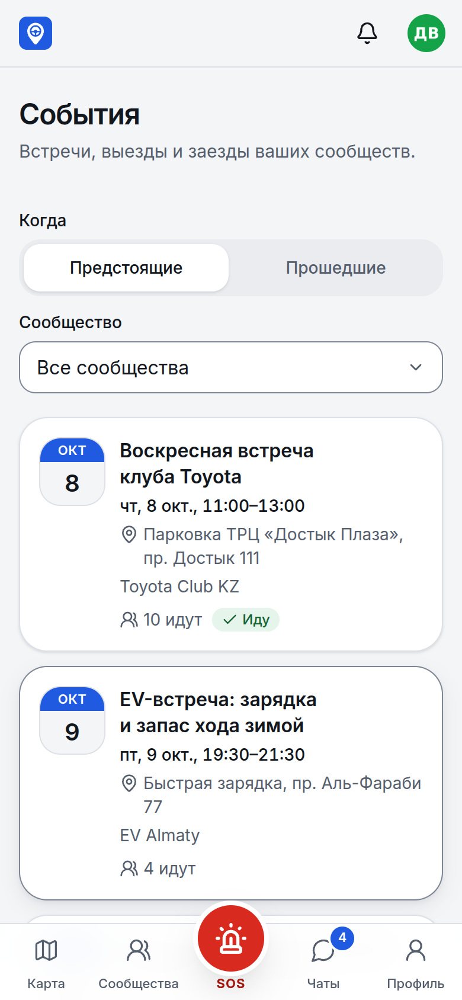
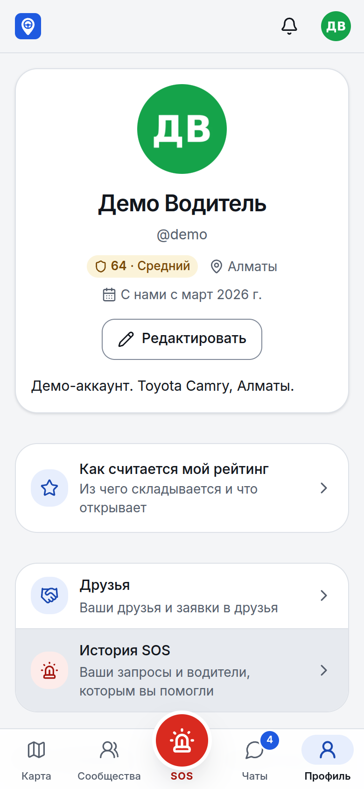
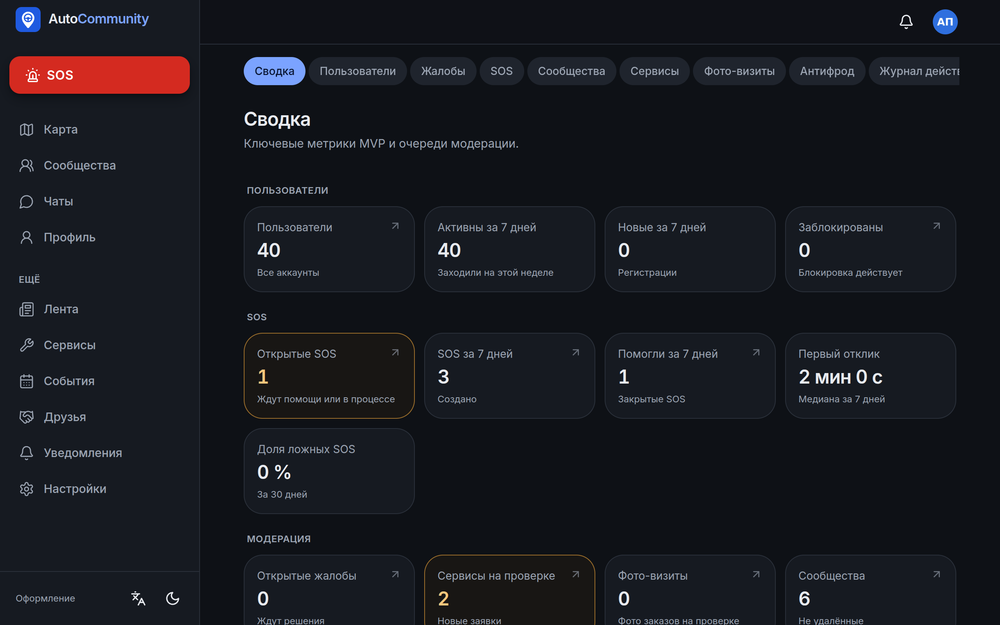

# AutoCommunity

**A social platform for drivers: a live map, communities, SOS roadside help, service centers and a trust rating.**
Pilot city: Almaty, Kazakhstan. Mobile-first installable web app (PWA) with a NestJS + PostgreSQL/PostGIS API.

<p align="center">
  
  
  
  
</p>
<p align="center">
  
  
  
  
</p>
<p align="center">
  
</p>

<sub>Screenshots from the seeded Almaty demo (Russian UI; English is one tap away). The map screenshot uses the OpenStreetMap raster fallback, because the build sandbox has no GPU for vector tiles.</sub>


## What it does

| Area | Features |
|---|---|
| **Accounts** | Phone sign-in with SMS code (Google / Apple ready, enabled by keys), onboarding, profile, up to 5 cars, account deletion |
| **Live map** | Drivers around you, clustered. Privacy modes: hidden / friends / communities / everyone. Strangers only ever see a ~500 m approximate position, and plates are never on the map. One tap to go invisible |
| **Friends** | Requests with a re-request cooldown, live notifications, friends-only map filter |
| **Communities** | Open and private clubs, join requests, owner / moderator roles, moderation, community map filter |
| **Chats** | Community and direct chats: text, photos, location, voice messages, typing indicator, read receipts |
| **SOS** | Request help with type, photos and location. Nearby helpers are found with a growing radius (5 → 10 → 20 km). Help / Call / Message, accept up to 3 helpers, SOS group chat, a share link for a trusted contact, a "Call 112" button everywhere |
| **Trust rating** | A transparent 0–100 score: help given, reviews, activity, tenure and penalties, with caps and time decay. Mutual reviews after a closed SOS; reports |
| **Service centers** | Repair shops, tire, wash, parts and tow. Map and list, open-now, visit verification (on site ≤ 150 m / QR at the counter / order photo), reviews only after a verified visit |
| **Events & feed** | Community events with routes and RSVP chats; a feed with photos, video and polls |
| **Admin** | Users (warn / block / SOS ban), reports queue, SOS review (mark fake), service and visit moderation, audit log, antifraud flags |
| **Notifications** | In-app, live over Socket.IO, and Web Push for every event type |

## Stack

| Layer | Choice |
|---|---|
| Web | Next.js 15 (App Router), React 19, TanStack Query, Tailwind CSS 4, Radix UI, MapLibre GL, next-intl (ru / en), PWA |
| API | NestJS 11, Prisma 6, PostgreSQL 16 + PostGIS 3, Redis 7, BullMQ, Socket.IO (Redis adapter), web-push, sharp |
| Shared | `packages/shared`: zod schemas and DTO types used by both sides (one contract) |
| Tests | Vitest (unit + integration against real Postgres/Redis), Playwright (e2e, mobile + desktop) |

Why each piece was chosen: [ARCHITECTURE.md](ARCHITECTURE.md).

## Run locally

You need **Node.js 22+**, **pnpm 10** (`npm i -g pnpm@10`) and **Docker Desktop** (for Postgres + PostGIS and Redis).

```bash
git clone https://github.com/Maquldar/autocommunity
cd autocommunity
docker compose up -d        # Postgres + PostGIS on :5432, Redis on :6379
pnpm install
pnpm setup:local            # creates apps/api/.env and apps/web/.env.local with fresh secrets
pnpm db:migrate
pnpm db:seed                # demo data: drivers, communities, chats, SOS, services, events, posts in Almaty
pnpm dev                    # API on http://localhost:4000, website on http://localhost:3000
```

Open **http://localhost:3000** and sign in:
- Demo user `+7 700 000 00 02`, admin `+7 700 000 00 01`, or any `+7` number for a new account.
- No SMS is sent locally: **the code is shown on the login screen**.

Troubleshooting (Windows, ARM, ports): see the [Troubleshooting](#troubleshooting) section below.

## Deploy a public demo

One click on Render's free plan: [DEPLOY.md](DEPLOY.md).

## Architecture in one picture

```
Browser (PWA) ──HTTPS──► Next.js ──► NestJS API ──► PostgreSQL + PostGIS
     ▲                                  │   │
     └──────── Socket.IO (/rt) ◄────────┘   └──► Redis (rate limits, Socket.IO adapter, BullMQ jobs)
                                                      │
                               Web Push ◄── push / SOS dispatch / reminders (BullMQ workers)
```

- **Privacy is enforced in SQL.** The map query applies the privacy rules and snaps strangers to a grid inside the database, so hidden positions never leave it.
- **SOS dispatch is a job pipeline.** It finds eligible helpers by radius and freshness, notifies them, then widens the radius on delayed jobs until someone accepts.
- **The trust rating is a pure function over a ledger** (`packages/shared/src/rating.ts`), so every change can be explained.

Details: [ARCHITECTURE.md](ARCHITECTURE.md) · API contract: [API.md](API.md) · Design system: [DESIGN.md](DESIGN.md) · Security: [SECURITY.md](SECURITY.md).

## Quality

| Check | Result (final combined run) |
|---|---|
| TypeScript strict typecheck (shared, API, web) | 0 errors |
| API tests: unit + integration against real PostgreSQL/PostGIS and Redis | **390 / 390** |
| Web unit tests | **385 / 385** |
| Shared package tests | **42 / 42** |
| Playwright e2e (mobile + desktop, multi-browser journeys: live SOS, chat, friend requests, admin) | **62 passed, 0 failed** (14 skipped by design: journeys that run in one project only) |
| Load test (k6, 4 vCPU, single API process) | 50 VUs: p95 197 ms, 0 % errors · 200 VUs: p95 1.64 s, 0 % errors ([load/RESULTS.md](load/RESULTS.md)) |


Each phase went through an adversarial review: an agent tried to break the code with real requests. All findings were fixed with regression tests. The history is in [PROGRESS.md](PROGRESS.md).

```bash
pnpm test     # unit + integration (needs Postgres + Redis running)
pnpm e2e      # Playwright (needs the API and website running; see apps/web/playwright.config.ts)
```

## Troubleshooting

- `Can't reach database server at localhost:5432`: Docker isn't running, or `docker compose up -d` wasn't run.
- Port 5432 already in use: a local Postgres is running; stop it, or change the port in `docker-compose.yml` and `DATABASE_URL`.
- `pnpm: command not found`: run `npm i -g pnpm@10`. In PowerShell, if scripts are blocked: `Set-ExecutionPolicy -Scope CurrentUser RemoteSigned`.
- Docker says "virtualization support not detected": enable Intel VT-x / AMD SVM in the BIOS and run `wsl --install`.
- Apple Silicon / ARM Windows: the PostGIS image runs under emulation (`platform: linux/amd64`). It's slower to start, but it works.
- Testing on a phone: location features need HTTPS on phones, so use the public deploy.

## Scope and roadmap

**Built:** everything in the plan's MVP and version 2.0. **Not built** (with reasons): [KNOWN_GAPS.md](KNOWN_GAPS.md). The main gaps:
- a native Flutter app (replaced by the PWA);
- store publishing;
- monetization (Premium, business accounts);
- v3.0 (AI assistant, OBD-II, parts marketplace, insurance).

**Roadmap:**
1. Real SMS provider and Google / Apple sign-in keys.
2. Cloudflare R2 storage.
3. A pilot with an Almaty car club.
4. A Flutter client on the same API (with background location).
5. Premium and business accounts for service centers.

## Docs

[SPEC.md](SPEC.md) · [ARCHITECTURE.md](ARCHITECTURE.md) · [API.md](API.md) · [DESIGN.md](DESIGN.md) · [SECURITY.md](SECURITY.md) · [PROGRESS.md](PROGRESS.md) · [KNOWN_GAPS.md](KNOWN_GAPS.md) · [DEPLOY.md](DEPLOY.md) · [PLAN.md](PLAN.md) (original plan, in Russian)
